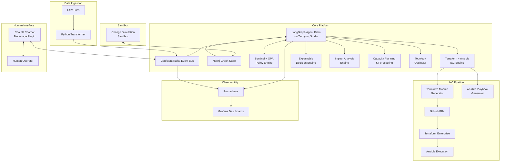
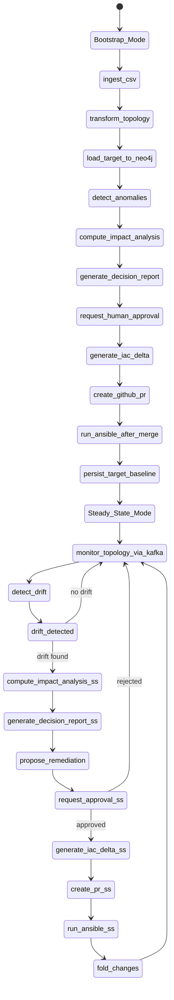
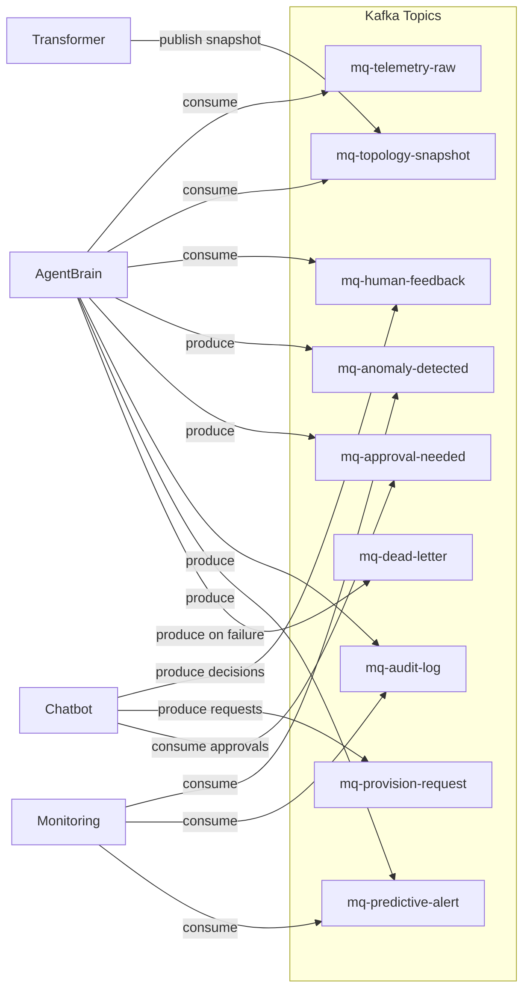
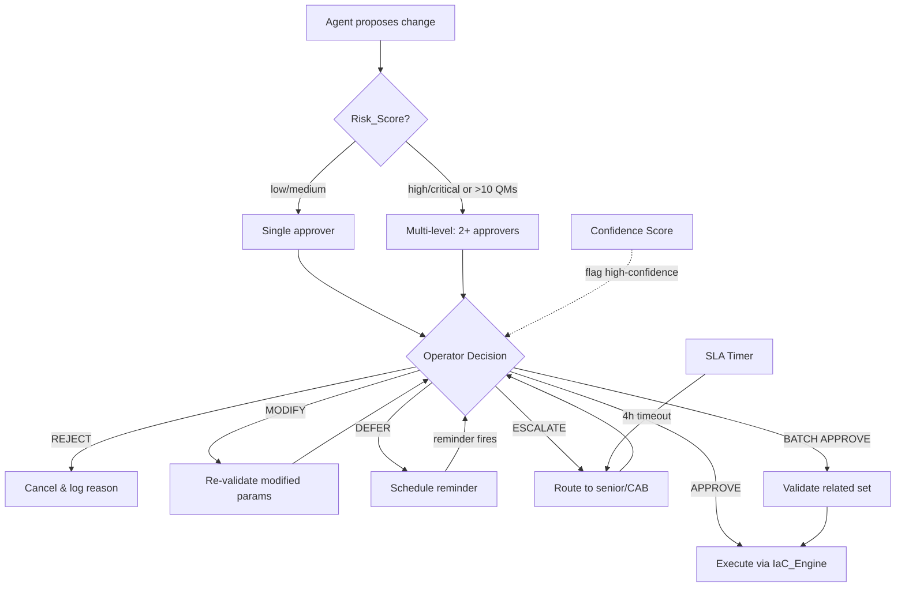
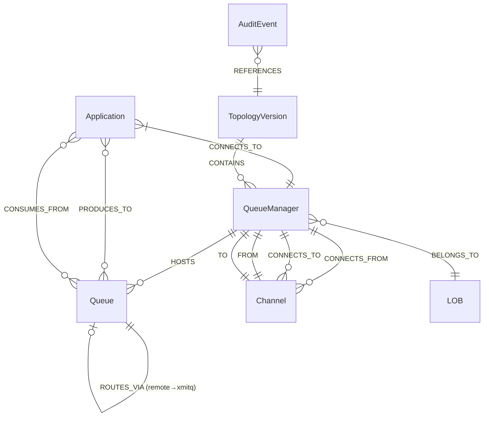

# Design Document: MQ Guardian Platform

## Overview

The MQ Guardian Platform is an enterprise-grade IBM MQ topology management system for a large regulated bank. It operates in two distinct modes:

1. **Bootstrap_Mode**: One-time ingestion of legacy CSV datasets (up to 14K rows), transformation into a compliant target-state topology, and loading into a Neo4j graph database.
2. **Steady_State_Mode**: Continuous monitoring for topology drift, anomaly detection, new application onboarding, optimization recommendations, and remediation — all gated by Human-in-the-Loop (HiTL) approval workflows.

The platform is built on Tachyon_Studio (the bank's internal agentic development platform) and integrates LangGraph/LangChain for agent orchestration, Confluent Kafka for event-driven communication, Terraform + Ansible for IaC, Sentinel + OPA for policy enforcement, Chainlit for the chatbot interface, and Prometheus + Grafana for monitoring.

### Key Design Decisions

| Decision | Rationale |
|---|---|
| Neo4j as Graph_Store | MQ topologies are inherently graph-structured (QMs, queues, channels, apps). Cypher enables efficient traversal for blast radius, dependency analysis, and constraint validation. |
| Kafka as Event_Bus | Decouples components, provides replay capability, supports correlation-based traceability, and enables backpressure handling at enterprise scale. |
| LangGraph for Agent_Brain | Provides stateful, multi-step agentic workflows with built-in support for human-in-the-loop patterns, tool calling, and state persistence. |
| Sentinel + OPA dual policy engine | Sentinel handles Terraform-level policy checks; OPA handles fine-grained data validation and access control. Covers both IaC and runtime policy enforcement. |
| Terraform + Ansible split | Terraform provisions infrastructure (QMs, networking); Ansible configures MQ objects (queues, channels) on provisioned QMs. Separation of concerns. |
| Docker Compose for local dev | All components (Neo4j, Kafka, Agent_Brain, Chatbot, Prometheus, Grafana) run locally without external dependencies. |

## Architecture

### High-Level System Architecture



### Dual-Mode Operation Flow



### Kafka Event Flow Architecture



### HiTL Approval Workflow



## Components and Interfaces

### 1. Python Transformer

Responsible for CSV ingestion, validation, and topology transformation during Bootstrap_Mode.

```python
# transformer/core.py

from dataclasses import dataclass, field
from typing import Optional
from enum import Enum

class CSVValidationError(Exception):
    """Raised when CSV contains malformed rows or missing columns."""
    def __init__(self, file: str, row: int, column: str, message: str):
        self.file = file
        self.row = row
        self.column = column
        self.message = message

class ObjectType(Enum):
    QUEUE_MANAGER = "queue_manager"
    LOCAL_QUEUE = "local_queue"
    REMOTE_QUEUE = "remote_queue"
    TRANSMISSION_QUEUE = "transmission_queue"
    CHANNEL_SENDER = "channel_sender"
    CHANNEL_RECEIVER = "channel_receiver"
    APPLICATION = "application"

@dataclass
class MQObject:
    id: str
    object_type: ObjectType
    name: str
    owning_qm: Optional[str] = None
    metadata: dict = field(default_factory=dict)

@dataclass
class TopologySnapshot:
    snapshot_id: str
    timestamp: str
    queue_managers: list[MQObject] = field(default_factory=list)
    queues: list[MQObject] = field(default_factory=list)
    channels: list[MQObject] = field(default_factory=list)
    applications: list[MQObject] = field(default_factory=list)
    producer_consumer_map: dict[str, list[str]] = field(default_factory=dict)

class CSVParser:
    """Parses and validates CSV files into structured MQObject lists."""

    def parse_file(self, filepath: str, expected_columns: list[str]) -> list[dict]:
        """Parse a single CSV file with column validation.
        Raises CSVValidationError on malformed rows or missing columns.
        Must complete within 30s for datasets up to 14K rows.
        """
        ...

    def validate_row(self, row: dict, row_num: int, file: str) -> None:
        """Validate a single row for required fields and data types."""
        ...

class TopologyTransformer:
    """Transforms as-is topology into compliant target-state topology."""

    def transform(self, as_is: TopologySnapshot) -> TopologySnapshot:
        """Produce target topology with reduced channels, eliminated
        redundant objects, minimized hops, no cycles, balanced fan-in/out.
        """
        ...

    def _eliminate_redundant_objects(self, snapshot: TopologySnapshot) -> TopologySnapshot:
        """Remove unused QMs, orphaned queues, and redundant channels."""
        ...

    def _minimize_routing_hops(self, snapshot: TopologySnapshot) -> TopologySnapshot:
        """Optimize channel routing to minimize hops between communicating apps."""
        ...

    def _detect_cycles(self, snapshot: TopologySnapshot) -> list[list[str]]:
        """Detect cycles in the channel routing graph using DFS."""
        ...

    def _balance_fan_in_out(self, snapshot: TopologySnapshot) -> TopologySnapshot:
        """Redistribute channels to avoid excessive fan-in/fan-out on any QM."""
        ...

    def export_to_csv(self, snapshot: TopologySnapshot, output_dir: str) -> list[str]:
        """Export topology to CSV files with structure identical to input format.
        Returns list of generated file paths.
        """
        ...

class ComplexityAnalyzer:
    """Computes quantitative complexity metrics for topology snapshots."""

    def compute_metric(self, snapshot: TopologySnapshot) -> "ComplexityMetric":
        """Compute complexity based on channel count, avg routing hops,
        fan-in/fan-out ratios, and redundant object count.
        """
        ...

    def compare(self, as_is: "ComplexityMetric", target: "ComplexityMetric") -> "ComplexityComparison":
        """Produce comparative analysis with absolute and percentage changes."""
        ...

@dataclass
class ComplexityMetric:
    total_channels: int
    avg_routing_hops: float
    max_fan_in: int
    max_fan_out: int
    avg_fan_in: float
    avg_fan_out: float
    redundant_objects: int
    composite_score: float  # weighted aggregate

@dataclass
class ComplexityComparison:
    as_is: ComplexityMetric
    target: ComplexityMetric
    channel_reduction: int
    channel_reduction_pct: float
    hop_reduction: float
    hop_reduction_pct: float
    redundant_reduction: int
    composite_improvement_pct: float
```

### 2. Neo4j Graph Store

```python
# graph_store/neo4j_client.py

from typing import Optional

class Neo4jGraphStore:
    """Manages topology persistence, versioning, and querying in Neo4j."""

    def __init__(self, uri: str, user: str, password: str):
        ...

    def load_snapshot(self, snapshot: "TopologySnapshot", version_tag: str) -> None:
        """Create/update nodes and edges for all MQ objects.
        Preserves all original CSV attributes as properties.
        Retains previous snapshot as versioned historical record.
        """
        ...

    def get_current_topology(self, lob: Optional[str] = None) -> "TopologySnapshot":
        """Retrieve current target-state topology, optionally filtered by LOB."""
        ...

    def get_historical_snapshot(self, version_tag: str) -> "TopologySnapshot":
        """Retrieve a specific historical topology version."""
        ...

    def query_blast_radius(self, change_proposal: dict) -> dict:
        """Traverse graph to find all directly and transitively affected objects."""
        ...

    def query_downstream_dependencies(self, object_ids: list[str]) -> dict:
        """Find all downstream consumers, channels, and xmitqs."""
        ...

    def query_cross_lob_dependencies(self, lob: str) -> list[dict]:
        """Identify channels and flows crossing LOB boundaries."""
        ...

    def create_sandbox_copy(self, session_id: str) -> "SandboxHandle":
        """Create an in-memory copy of the target topology for simulation."""
        ...

    def assign_lob(self, object_id: str, lob: str) -> None:
        """Assign an MQ object to a Line of Business."""
        ...

    def persist_audit_event(self, event: dict) -> None:
        """Store immutable audit record with timestamp, correlation_id, actor, etc."""
        ...

    def query_audit_log(
        self, time_range: tuple = None, action_type: str = None,
        actor: str = None, affected_object: str = None, correlation_id: str = None
    ) -> list[dict]:
        """Query audit records with filters."""
        ...
```

#### Neo4j Schema (Cypher)

```cypher
// Node types
CREATE CONSTRAINT qm_unique IF NOT EXISTS FOR (qm:QueueManager) REQUIRE qm.id IS UNIQUE;
CREATE CONSTRAINT queue_unique IF NOT EXISTS FOR (q:Queue) REQUIRE q.id IS UNIQUE;
CREATE CONSTRAINT app_unique IF NOT EXISTS FOR (a:Application) REQUIRE a.id IS UNIQUE;
CREATE CONSTRAINT channel_unique IF NOT EXISTS FOR (c:Channel) REQUIRE c.id IS UNIQUE;
CREATE CONSTRAINT audit_unique IF NOT EXISTS FOR (au:AuditEvent) REQUIRE au.id IS UNIQUE;

// Relationship types
// (:Application)-[:CONNECTS_TO]->(:QueueManager)
// (:Queue)-[:HOSTED_ON]->(:QueueManager)
// (:Application)-[:PRODUCES_TO]->(:Queue {type: 'remote'})
// (:Application)-[:CONSUMES_FROM]->(:Queue {type: 'local'})
// (:Queue {type: 'remote'})-[:ROUTES_VIA]->(:Queue {type: 'transmission'})
// (:Queue {type: 'transmission'})-[:TRANSMITS_TO]->(:Channel)
// (:Channel)-[:CONNECTS]->(:QueueManager)
// (:QueueManager)-[:BELONGS_TO]->(:LOB)

// Versioning: each snapshot tagged with version
// (:TopologyVersion {tag: 'v1', timestamp: datetime()})
// (:QueueManager)-[:IN_VERSION]->(:TopologyVersion)
```

### 3. LangGraph Agent Brain

The central intelligence component, deployed on Tachyon_Studio, orchestrating both Bootstrap and Steady_State workflows.

```python
# agent_brain/state.py

from pydantic import BaseModel, Field
from typing import Optional, Literal
from datetime import datetime

class AgentState(BaseModel):
    """Pydantic state model for the Agent_Brain LangGraph workflow."""
    current_mode: Literal["bootstrap", "steady_state"]
    snapshot: Optional[dict] = None
    graph_data: Optional[dict] = None
    anomalies: list[dict] = Field(default_factory=list)
    drift_events: list[dict] = Field(default_factory=list)
    proposed_fixes: list[dict] = Field(default_factory=list)
    human_approval_needed: bool = False
    approval_id: Optional[str] = None
    correlation_id: Optional[str] = None
    impact_analysis: Optional[dict] = None
    decision_report: Optional[dict] = None
    audit_log: list[dict] = Field(default_factory=list)
    timestamp: datetime = Field(default_factory=datetime.utcnow)
    confidence_scores: dict[str, float] = Field(default_factory=dict)
```

```python
# agent_brain/graph.py

from langgraph.graph import StateGraph, END

class AgentBrainGraph:
    """LangGraph workflow definition for the Agent_Brain."""

    def build_bootstrap_graph(self) -> StateGraph:
        """Build the Bootstrap_Mode workflow graph.
        Steps: ingest_csv → transform_topology → load_target_to_neo4j →
               detect_anomalies → compute_impact_analysis →
               generate_decision_report → request_human_approval →
               generate_iac_delta → create_github_pr →
               run_ansible_after_merge → persist_target_baseline
        """
        ...

    def build_steady_state_graph(self) -> StateGraph:
        """Build the Steady_State_Mode continuous loop.
        Steps: monitor_topology_via_kafka → detect_drift →
               (if drift) compute_impact_analysis → generate_decision_report →
               propose_remediation → request_human_approval →
               (on approval) generate_iac_delta → create_github_pr →
               run_ansible_after_merge → fold_changes_into_target_topology
        """
        ...

    # --- Node functions ---

    def ingest_csv(self, state: "AgentState") -> "AgentState":
        """Parse CSV files, validate, publish snapshot to Event_Bus."""
        ...

    def transform_topology(self, state: "AgentState") -> "AgentState":
        """Run TopologyTransformer to produce target-state topology."""
        ...

    def load_target_to_neo4j(self, state: "AgentState") -> "AgentState":
        """Load target topology into Graph_Store."""
        ...

    def detect_anomalies(self, state: "AgentState") -> "AgentState":
        """Detect rule-based anomalies: policy violations, orphaned queues,
        disconnected QMs, constraint breaches. Classify severity."""
        ...

    def detect_drift(self, state: "AgentState") -> "AgentState":
        """Compare live topology against target-state in Graph_Store.
        Classify drift as configuration_drift, structural_drift, or policy_drift.
        """
        ...

    def compute_impact_analysis(self, state: "AgentState") -> "AgentState":
        """Compute blast radius, risk score, downstream deps, rollback plan.
        Simulate change against graph model without modifying production.
        """
        ...

    def generate_decision_report(self, state: "AgentState") -> "AgentState":
        """Generate Decision_Report with reasoning chain, alternatives,
        policy references. Format as structured JSON.
        """
        ...

    def request_human_approval(self, state: "AgentState") -> "AgentState":
        """Publish approval request to mq-approval-needed topic.
        Include blast_radius, risk_score, decision_report, rollback_plan.
        Pause execution until response on mq-human-feedback.
        """
        ...

    def generate_iac_delta(self, state: "AgentState") -> "AgentState":
        """Generate Terraform modules and Ansible playbooks for the change."""
        ...

    def create_github_pr(self, state: "AgentState") -> "AgentState":
        """Create GitHub PR with TF configs, variable files, plan output."""
        ...

    def run_ansible_after_merge(self, state: "AgentState") -> "AgentState":
        """Execute Ansible playbooks after PR merge and TF apply."""
        ...

    def persist_target_baseline(self, state: "AgentState") -> "AgentState":
        """Persist target topology as authoritative baseline for drift detection."""
        ...

    def fold_changes_into_target(self, state: "AgentState") -> "AgentState":
        """Update target-state topology with applied changes, verify compliance."""
        ...
```

```python
# agent_brain/kafka_consumer.py

from confluent_kafka import Consumer, KafkaError
from typing import Callable
import threading

class AgentBrainKafkaConsumer:
    """Embedded Kafka consumer for the Agent_Brain with deep integration."""

    CONSUMER_GROUP = "mq-guardian-agent-brain"
    CONSUMED_TOPICS = ["mq-telemetry-raw", "mq-topology-snapshot", "mq-human-feedback"]
    PRODUCED_TOPICS = ["mq-anomaly-detected", "mq-approval-needed", "mq-audit-log", "mq-predictive-alert"]

    def __init__(self, bootstrap_servers: str, backpressure_threshold: int = 1000):
        self._consumer: Consumer = None
        self._backpressure_threshold = backpressure_threshold
        self._paused_topics: set = set()
        self._lag_metrics: dict[str, int] = {}
        ...

    def start(self) -> None:
        """Start consuming from all subscribed topics."""
        ...

    def _on_rebalance(self, consumer, partitions) -> None:
        """Handle consumer rebalance: commit offsets before, restore after,
        log rebalance event to mq-audit-log.
        """
        ...

    def _process_message(self, message) -> None:
        """Process a consumed message with 3-retry logic.
        On 3rd failure, route to mq-dead-letter with original payload,
        error description, retry count, and correlation_id.
        """
        ...

    def _handle_backpressure(self, topic: str) -> None:
        """Pause consumption on overloaded topic, process backlog,
        resume when backlog drops below threshold.
        """
        ...

    def reset_offset(self, topic: str, timestamp_or_offset) -> None:
        """Reset consumer offset for replay/recovery."""
        ...

    def get_consumer_lag(self) -> dict[str, int]:
        """Return lag per topic-partition. Publish to Prometheus.
        Alert if lag exceeds threshold.
        """
        ...

    def _commit_offsets_after_processing(self) -> None:
        """Commit offsets only after successful processing and persistence.
        Ensures at-least-once semantics.
        """
        ...

    def _retry_connection(self) -> None:
        """Exponential backoff: 1s initial, 60s max. Publish connectivity alert."""
        ...
```

### 4. Kafka Event Bus

```python
# event_bus/schemas.py

KAFKA_TOPICS = {
    "mq-telemetry-raw": "Live MQ telemetry data",
    "mq-topology-snapshot": "Complete topology snapshots",
    "mq-anomaly-detected": "Detected anomalies and drift events",
    "mq-provision-request": "Provisioning requests from Chatbot",
    "mq-approval-needed": "HiTL approval requests",
    "mq-human-feedback": "Human approval/rejection decisions",
    "mq-audit-log": "Full audit trail",
    "mq-predictive-alert": "Prophet ML forecasting alerts",
    "mq-dead-letter": "Failed messages after retry exhaustion",
}

# Every message schema includes correlation_id for end-to-end traceability
BASE_EVENT_SCHEMA = {
    "type": "object",
    "required": ["event_id", "correlation_id", "timestamp", "event_type", "payload"],
    "properties": {
        "event_id": {"type": "string", "format": "uuid"},
        "correlation_id": {"type": "string", "format": "uuid"},
        "timestamp": {"type": "string", "format": "date-time"},
        "event_type": {"type": "string"},
        "payload": {"type": "object"},
    }
}

APPROVAL_REQUEST_SCHEMA = {
    **BASE_EVENT_SCHEMA,
    "properties": {
        **BASE_EVENT_SCHEMA["properties"],
        "payload": {
            "type": "object",
            "required": [
                "approval_id", "change_description", "blast_radius",
                "risk_score", "decision_report", "rollback_plan"
            ],
            "properties": {
                "approval_id": {"type": "string", "format": "uuid"},
                "change_description": {"type": "string"},
                "blast_radius": {"type": "object"},
                "risk_score": {"type": "string", "enum": ["low", "medium", "high", "critical"]},
                "decision_report": {"type": "object"},
                "rollback_plan": {"type": "object"},
            }
        }
    }
}

HUMAN_FEEDBACK_SCHEMA = {
    "type": "object",
    "required": ["approval_id", "correlation_id", "decision", "timestamp"],
    "properties": {
        "approval_id": {"type": "string"},
        "correlation_id": {"type": "string"},
        "decision": {
            "type": "string",
            "enum": ["approve", "reject", "modify", "defer", "escalate", "batch_approve"]
        },
        "modified_params": {"type": "object"},
        "rejection_reason": {"type": "string"},
        "defer_reminder_timestamp": {"type": "string", "format": "date-time"},
        "batch_approval_ids": {"type": "array", "items": {"type": "string"}},
        "timestamp": {"type": "string", "format": "date-time"},
    }
}

DECISION_REPORT_SCHEMA = {
    "type": "object",
    "required": ["summary", "reasoning_chain", "policy_references",
                  "alternatives_considered", "risk_assessment", "recommendation"],
    "properties": {
        "summary": {"type": "string"},
        "reasoning_chain": {"type": "array", "items": {"type": "string"}},
        "policy_references": {
            "type": "array",
            "items": {
                "type": "object",
                "properties": {
                    "policy_id": {"type": "string"},
                    "description": {"type": "string"}
                }
            }
        },
        "alternatives_considered": {
            "type": "array",
            "items": {
                "type": "object",
                "properties": {
                    "action": {"type": "string"},
                    "rejection_reason": {"type": "string"}
                }
            }
        },
        "risk_assessment": {"type": "string"},
        "recommendation": {"type": "string"},
    }
}
```

### 5. IaC Engine (Terraform + Ansible)

```python
# iac_engine/terraform_generator.py

class TerraformModuleGenerator:
    """Generates granular, environment-aware Terraform modules."""

    def generate_module(
        self, object_type: str, objects: list[dict], environment: str
    ) -> dict[str, str]:
        """Generate a Terraform module for a specific MQ object type.
        Returns dict of filename -> content.
        Separate modules for: queue_managers, queues_local, queues_remote,
        queues_transmission, channels.
        """
        ...

    def generate_variable_files(
        self, environment: str, params: dict
    ) -> dict[str, str]:
        """Generate tfvars files parameterized per environment (dev/staging/prod).
        Includes hostnames, ports, credential refs, resource limits.
        """
        ...

    def generate_remote_state_config(
        self, backend: str, environment: str
    ) -> str:
        """Generate backend config for S3/Azure Blob with state locking."""
        ...

    def generate_import_statements(
        self, existing_resources: list[dict]
    ) -> str:
        """Generate terraform import statements for existing unmanaged resources."""
        ...

    def generate_workspace_config(self, environments: list[str]) -> str:
        """Generate workspace configs for multi-environment deployments."""
        ...

    def generate_output_definitions(self, modules: list[str]) -> str:
        """Generate output definitions for cross-module references:
        QM endpoints, queue names, channel identifiers.
        """
        ...

    def validate(self, module_dir: str) -> tuple[bool, str]:
        """Run 'terraform validate' and return (success, output).
        Must produce zero errors for valid configurations.
        """
        ...
```

```python
# iac_engine/ansible_generator.py

class AnsiblePlaybookGenerator:
    """Generates Ansible playbooks, inventories, roles, and vault configs."""

    def generate_playbook(
        self, action: str, objects: list[dict]
    ) -> str:
        """Generate playbook for MQ object CRUD (create/update/delete).
        Covers: queue managers, queues (local/remote/transmission), channels.
        """
        ...

    def generate_dynamic_inventory(
        self, topology: "TopologySnapshot"
    ) -> str:
        """Generate dynamic inventory grouped by QM, neighborhood, region."""
        ...

    def generate_roles(self) -> dict[str, str]:
        """Generate reusable roles: qm_setup, queue_creation,
        channel_pair_creation, security_config.
        """
        ...

    def generate_vault_config(self, secrets: dict) -> str:
        """Encrypt credentials and TLS certs with Ansible Vault."""
        ...

    def generate_handlers(self) -> str:
        """Generate handlers for MQ service restart/reload on config changes."""
        ...

    def generate_callback_plugin(self) -> str:
        """Generate callback plugin config for real-time status reporting
        to Agent_Brain via mq-audit-log topic.
        """
        ...

    def syntax_check(self, playbook_path: str) -> tuple[bool, str]:
        """Run 'ansible-playbook --syntax-check'. Must produce zero errors."""
        ...
```

```python
# iac_engine/pipeline.py

class IaCPipeline:
    """Orchestrates the full IaC pipeline: TF plan → PR → apply → Ansible."""

    def execute_terraform_plan(self, module_dir: str) -> str:
        """Run terraform plan (dry-run), return plan output for operator review."""
        ...

    def create_github_pr(
        self, tf_files: dict, plan_output: str, change_description: str
    ) -> str:
        """Create GitHub PR with TF configs, variable files, plan summary."""
        ...

    def on_pr_merged(self, pr_id: str) -> None:
        """Trigger Terraform Enterprise apply on PR merge."""
        ...

    def execute_terraform_apply(self, workspace: str) -> tuple[bool, str]:
        """Apply TF config. On failure: publish failure event, rollback, notify."""
        ...

    def execute_ansible_dry_run(self, playbook_path: str) -> str:
        """Run ansible in check mode, return output for operator review."""
        ...

    def execute_ansible(self, playbook_path: str) -> tuple[bool, str]:
        """Execute ansible playbook. On failure: publish event, rollback, notify."""
        ...

    def compute_state_diff(self, workspace: str) -> dict:
        """Diff current TF state vs desired state from Graph_Store."""
        ...
```

### 6. Policy Engine (Sentinel + OPA)

```python
# policy_engine/engine.py

from dataclasses import dataclass

@dataclass
class PolicyViolation:
    policy_id: str
    policy_name: str
    description: str
    offending_objects: list[str]
    remediation_suggestion: str

class PolicyEngine:
    """Evaluates Sentinel and OPA policies against topology changes."""

    # MQ Constraint Policies (Sentinel)
    MQ_POLICIES = [
        "exactly_one_qm_per_app",
        "producers_write_to_remote_queue_on_own_qm",
        "remote_queue_uses_xmitq_via_channel",
        "deterministic_channel_naming",
        "consumers_read_from_local_queue_on_own_qm",
        "secure_by_default",
        "neighbourhood_aligned",
    ]

    def evaluate_sentinel(self, change_proposal: dict) -> list[PolicyViolation]:
        """Evaluate Sentinel policies against a proposed change.
        Returns list of violations (empty = all pass).
        """
        ...

    def evaluate_opa(self, change_proposal: dict, actor: dict) -> list[PolicyViolation]:
        """Evaluate OPA policies for access control and data validation."""
        ...

    def evaluate_all(self, change_proposal: dict, actor: dict) -> tuple[bool, list[PolicyViolation]]:
        """Run all Sentinel + OPA policies. Returns (passed, violations)."""
        ...

    def evaluate_lob_policies(
        self, change_proposal: dict, lob: str
    ) -> list[PolicyViolation]:
        """Evaluate LOB-specific policies in addition to global policies."""
        ...

    def generate_compliance_attestation(self, change_proposal: dict) -> dict:
        """Generate attestation document when all policies pass."""
        ...

    def validate_mq_constraints(self, topology: "TopologySnapshot") -> list[PolicyViolation]:
        """Validate full topology against all MQ constraints.
        Checks: 1 QM per app, producer→remoteQ, remoteQ→xmitq→channel,
        deterministic naming, consumer→localQ.
        """
        ...
```

### 7. Explainable Decision Engine

```python
# decision_engine/engine.py

class ExplainableDecisionEngine:
    """Generates structured Decision_Reports for every topology change proposal."""

    def generate_report(
        self,
        change_proposal: dict,
        graph_store: "Neo4jGraphStore",
        policy_engine: "PolicyEngine",
        historical_decisions: list[dict],
    ) -> dict:
        """Generate a Decision_Report containing:
        - summary: natural language explanation
        - reasoning_chain: ordered logic steps
        - policy_references: policies that influenced decision
        - alternatives_considered: rejected alternatives with reasons
        - risk_assessment: risk evaluation
        - recommendation: final recommendation
        """
        ...

    def evaluate_what_if(
        self, hypothetical_change: dict, graph_store: "Neo4jGraphStore",
        policy_engine: "PolicyEngine"
    ) -> dict:
        """Evaluate a hypothetical change without modifying production.
        Returns Decision_Report with projected outcome, compliance, complexity impact.
        """
        ...

    def compute_confidence_score(
        self, proposal: dict, historical_decisions: list[dict]
    ) -> float:
        """Analyze past approval/rejection patterns to compute confidence score.
        Flag as 'high-confidence' if above configurable threshold.
        """
        ...
```

### 8. Impact Analysis Engine

```python
# impact_analysis/engine.py

class ImpactAnalysisEngine:
    """Computes blast radius, risk score, dependencies, and rollback plans."""

    def compute_blast_radius(
        self, change_proposal: dict, graph_store: "Neo4jGraphStore"
    ) -> dict:
        """Traverse graph to find all directly and transitively affected
        apps, queues, channels, and QMs.
        """
        ...

    def compute_risk_score(
        self, blast_radius: dict, app_criticality: dict,
        historical_outcomes: list[dict]
    ) -> str:
        """Estimate risk: low, medium, high, critical.
        Based on affected object count, app criticality, historical data.
        """
        ...

    def identify_downstream_dependencies(
        self, change_proposal: dict, graph_store: "Neo4jGraphStore"
    ) -> list[dict]:
        """Find downstream consumers, channels routing through affected QMs,
        xmitqs depending on affected channels.
        """
        ...

    def generate_rollback_plan(
        self, change_proposal: dict, current_topology: "TopologySnapshot"
    ) -> dict:
        """Generate exact reversal actions to restore pre-change state."""
        ...

    def simulate_change(
        self, change_proposal: dict, graph_store: "Neo4jGraphStore",
        policy_engine: "PolicyEngine"
    ) -> dict:
        """Simulate change against graph model (no production modification).
        Validate post-change topology satisfies all constraints and policies.
        """
        ...
```

### 9. Capacity Planning & Forecasting

```python
# capacity_planning/engine.py

from prophet import Prophet

class CapacityPlanningEngine:
    """Analyzes growth patterns and predicts future capacity needs."""

    def analyze_growth_patterns(
        self, graph_store: "Neo4jGraphStore", lookback_days: int = 30
    ) -> dict:
        """Analyze QM count, queue count, channel count, message volume trends."""
        ...

    def forecast_capacity(
        self, growth_data: dict, horizon_days: int = 30,
        threshold_pct: float = 0.8
    ) -> list[dict]:
        """Use Prophet ML to predict when QMs reach capacity thresholds.
        Returns list of alerts with QM, predicted breach date, current util.
        """
        ...

    def simulate_onboarding_impact(
        self, onboarding_request: dict, graph_store: "Neo4jGraphStore"
    ) -> dict:
        """Forecast impact of new app on topology complexity."""
        ...

    def generate_capacity_report(
        self, graph_store: "Neo4jGraphStore"
    ) -> dict:
        """Weekly report: current util per QM, projected at 30/60/90 days,
        recommended scaling actions.
        """
        ...
```

### 10. Topology Optimizer

```python
# optimizer/engine.py

class TopologyOptimizer:
    """Suggests topology improvements beyond compliance maintenance."""

    def identify_consolidation_candidates(
        self, graph_store: "Neo4jGraphStore"
    ) -> list[dict]:
        """Find QMs that can be consolidated without violating constraints.
        Report projected complexity reduction.
        """
        ...

    def identify_channel_elimination(
        self, graph_store: "Neo4jGraphStore"
    ) -> list[dict]:
        """Find channels eliminable by rerouting through fewer hops."""
        ...

    def suggest_clustering_optimizations(
        self, graph_store: "Neo4jGraphStore"
    ) -> list[dict]:
        """Suggest neighborhood/region-based clustering to minimize cross-region traffic."""
        ...

    def recommend_placement(
        self, onboarding_request: dict, graph_store: "Neo4jGraphStore"
    ) -> dict:
        """Recommend optimal QM placement for new app based on topology patterns,
        neighborhood affinity, and complexity minimization.
        """
        ...

    def calculate_combined_improvement(
        self, recommendations: list[dict]
    ) -> dict:
        """Calculate individual and combined complexity reduction."""
        ...
```

### 11. Sandbox Engine

```python
# sandbox/engine.py

class SandboxEngine:
    """Manages change simulation sandbox sessions."""

    def __init__(self, graph_store: "Neo4jGraphStore"):
        self._sessions: dict[str, "SandboxSession"] = {}
        ...

    def create_session(self, operator_id: str) -> str:
        """Create isolated in-memory copy of target topology. Returns session_id."""
        ...

    def apply_change(self, session_id: str, change: dict) -> dict:
        """Apply change to sandbox copy. Return before/after complexity metrics."""
        ...

    def compose_changes(self, session_id: str, changes: list[dict]) -> dict:
        """Apply changes sequentially, show cumulative complexity impact."""
        ...

    def validate_sandbox(self, session_id: str) -> list["PolicyViolation"]:
        """Validate sandbox topology against Policy_Engine."""
        ...

    def export_as_proposal(self, session_id: str) -> dict:
        """Export simulated state as formal change proposal for HiTL workflow."""
        ...

    def destroy_session(self, session_id: str) -> None:
        """Discard sandbox copy without affecting production."""
        ...
```

### 12. Chatbot (Chainlit + FastAPI)

```python
# chatbot/app.py

from fastapi import FastAPI
import chainlit as cl

class MQGuardianChatbot:
    """Chainlit-based NL interface, deployed as standalone FastAPI service.
    Registered as Backstage IDP Marketplace plugin.
    """

    def __init__(self, event_bus: "KafkaProducer", graph_store: "Neo4jGraphStore"):
        ...

    async def handle_topology_query(self, query: str) -> str:
        """Retrieve topology data from Graph_Store, return human-readable response.
        Must respond within 5 seconds.
        """
        ...

    async def handle_anomaly_query(self) -> str:
        """Retrieve latest anomalies with severity, affected objects, remediations."""
        ...

    async def handle_provisioning_command(self, command: str) -> str:
        """Translate NL command to structured request, publish to mq-provision-request."""
        ...

    async def handle_approval_decision(
        self, approval_id: str, decision: str, **kwargs
    ) -> str:
        """Publish decision (approve/reject/modify/defer/escalate/batch)
        to mq-human-feedback topic.
        """
        ...

    async def handle_what_if_query(self, query: str) -> str:
        """Route what-if queries to Decision Engine, return projected outcome."""
        ...

    async def handle_sandbox_request(self, operator_id: str) -> str:
        """Create sandbox session for operator."""
        ...
```

### 13. Monitoring Stack

```python
# monitoring/dashboards.py

GRAFANA_DASHBOARDS = {
    "mq-topology-overview": {
        "title": "MQ Topology Overview",
        "panels": [
            "neo4j_graph_visualization",
            "complexity_metric_as_is",
            "complexity_metric_target",
            "complexity_comparison_chart",
        ]
    },
    "drift-anomaly-live": {
        "title": "Drift & Anomaly Live",
        "panels": [
            "realtime_anomalies_from_mq_anomaly_detected",
            "hitl_approval_queue",
            "drift_events_timeline",
            "anomaly_severity_distribution",
        ]
    },
    "predictive-maintenance": {
        "title": "Predictive Maintenance",
        "panels": [
            "prophet_forecast_charts",
            "capacity_trend_per_qm",
            "drift_trend_forecast",
        ]
    },
    "iac-pipeline-health": {
        "title": "IaC Pipeline Health",
        "panels": [
            "terraform_enterprise_run_status",
            "github_pr_lifecycle_metrics",
            "ansible_execution_status",
        ]
    },
    "audit-compliance": {
        "title": "Audit & Compliance",
        "panels": [
            "full_action_log_from_mq_audit_log",
            "policy_violation_history",
            "approval_decision_history",
        ]
    },
}

# Prometheus alert rules
ALERT_RULES = {
    "consumer_lag_high": {
        "expr": "kafka_consumer_lag > 10000",
        "for": "1m",
        "severity": "warning",
    },
    "anomaly_critical": {
        "expr": "mq_anomaly_severity == 'critical'",
        "for": "0s",
        "severity": "critical",
    },
    "terraform_apply_failed": {
        "expr": "terraform_apply_status == 'failed'",
        "for": "0s",
        "severity": "critical",
    },
}
```

### REST API Endpoints

| Endpoint | Method | Description | Req |
|---|---|---|---|
| `/api/v1/topology/ingest` | POST | Ingest CSV files (bootstrap or incremental) | 1 |
| `/api/v1/topology/snapshot` | GET | Get current topology snapshot (optional `?lob=` filter) | 2, 26 |
| `/api/v1/topology/snapshot/{version}` | GET | Get historical topology version | 2 |
| `/api/v1/topology/export/csv` | GET | Export target topology as CSV | 15 |
| `/api/v1/topology/export/dot` | GET | Export topology as DOT graph | 16 |
| `/api/v1/topology/visualization` | GET | Get topology visualization data | 16 |
| `/api/v1/complexity` | GET | Get complexity metrics (optional `?lob=` filter) | 5, 26 |
| `/api/v1/complexity/compare` | GET | Compare as-is vs target complexity | 5 |
| `/api/v1/anomalies` | GET | List detected anomalies | 6 |
| `/api/v1/drift` | GET | List drift events | 6, 20 |
| `/api/v1/approvals` | GET | List pending approval requests | 7 |
| `/api/v1/approvals/{id}` | POST | Submit approval decision | 7 |
| `/api/v1/approvals/batch` | POST | Batch approve related requests | 7 |
| `/api/v1/impact/{proposal_id}` | GET | Get impact analysis for a proposal | 22 |
| `/api/v1/capacity` | GET | Get capacity planning data | 23 |
| `/api/v1/capacity/report` | GET | Get latest capacity report | 23 |
| `/api/v1/optimization/recommendations` | GET | Get optimization recommendations | 24 |
| `/api/v1/sandbox` | POST | Create sandbox session | 25 |
| `/api/v1/sandbox/{session_id}/change` | POST | Apply change in sandbox | 25 |
| `/api/v1/sandbox/{session_id}/export` | POST | Export sandbox as proposal | 25 |
| `/api/v1/sandbox/{session_id}` | DELETE | Destroy sandbox session | 25 |
| `/api/v1/audit` | GET | Query audit records (filters: time, action, actor, object, correlation_id) | 12 |
| `/api/v1/policies/evaluate` | POST | Evaluate policies against a change | 9 |
| `/api/v1/decision-report/{id}` | GET | Get decision report | 21 |
| `/api/v1/what-if` | POST | Evaluate hypothetical change | 21 |

## Data Models

### Core Domain Models

```python
# models/domain.py

from pydantic import BaseModel, Field
from typing import Optional, Literal
from datetime import datetime
from enum import Enum

class QueueType(str, Enum):
    LOCAL = "local"
    REMOTE = "remote"
    TRANSMISSION = "transmission"

class ChannelDirection(str, Enum):
    SENDER = "sender"
    RECEIVER = "receiver"

class AnomalySeverity(str, Enum):
    CRITICAL = "critical"
    WARNING = "warning"
    INFORMATIONAL = "informational"

class RiskScore(str, Enum):
    LOW = "low"
    MEDIUM = "medium"
    HIGH = "high"
    CRITICAL = "critical"

class DriftType(str, Enum):
    CONFIGURATION = "configuration_drift"
    STRUCTURAL = "structural_drift"
    POLICY = "policy_drift"

class ApprovalDecision(str, Enum):
    APPROVE = "approve"
    REJECT = "reject"
    MODIFY = "modify"
    DEFER = "defer"
    ESCALATE = "escalate"
    BATCH_APPROVE = "batch_approve"

class OperationalMode(str, Enum):
    BOOTSTRAP = "bootstrap"
    STEADY_STATE = "steady_state"

# --- Core MQ Objects ---

class QueueManager(BaseModel):
    id: str
    name: str
    hostname: str
    port: int
    neighborhood: Optional[str] = None
    region: Optional[str] = None
    lob: Optional[str] = None
    max_queues: int = 5000
    max_channels: int = 1000
    metadata: dict = Field(default_factory=dict)

class Queue(BaseModel):
    id: str
    name: str
    queue_type: QueueType
    owning_qm_id: str
    target_qm_id: Optional[str] = None  # for remote queues
    xmitq_id: Optional[str] = None      # for remote queues
    lob: Optional[str] = None
    metadata: dict = Field(default_factory=dict)

class Channel(BaseModel):
    id: str
    name: str  # deterministic: fromQM.toQM or toQM.fromQM
    direction: ChannelDirection
    from_qm_id: str
    to_qm_id: str
    lob: Optional[str] = None
    metadata: dict = Field(default_factory=dict)

class Application(BaseModel):
    id: str
    name: str
    connected_qm_id: str  # exactly one QM per app
    role: Literal["producer", "consumer", "both"]
    produces_to: list[str] = Field(default_factory=list)   # queue IDs
    consumes_from: list[str] = Field(default_factory=list)  # queue IDs
    criticality: Optional[str] = None
    lob: Optional[str] = None
    metadata: dict = Field(default_factory=dict)

# --- Event Models ---

class TopologySnapshotEvent(BaseModel):
    snapshot_id: str
    correlation_id: str
    timestamp: datetime
    mode: OperationalMode
    queue_managers: list[QueueManager]
    queues: list[Queue]
    channels: list[Channel]
    applications: list[Application]

class AnomalyEvent(BaseModel):
    anomaly_id: str
    correlation_id: str
    timestamp: datetime
    anomaly_type: str
    severity: AnomalySeverity
    affected_objects: list[str]
    description: str
    recommended_remediation: str

class DriftEvent(BaseModel):
    drift_id: str
    correlation_id: str
    timestamp: datetime
    drift_type: DriftType
    affected_objects: list[str]
    delta_description: str
    proposed_remediation: str

class ApprovalRequest(BaseModel):
    approval_id: str
    correlation_id: str
    timestamp: datetime
    change_description: str
    blast_radius: dict
    risk_score: RiskScore
    decision_report: dict
    rollback_plan: dict
    requires_multi_level: bool = False
    affected_lobs: list[str] = Field(default_factory=list)

class ApprovalResponse(BaseModel):
    approval_id: str
    correlation_id: str
    timestamp: datetime
    decision: ApprovalDecision
    actor: str
    modified_params: Optional[dict] = None
    rejection_reason: Optional[str] = None
    defer_reminder: Optional[datetime] = None
    batch_approval_ids: Optional[list[str]] = None

class DecisionReport(BaseModel):
    report_id: str
    correlation_id: str
    summary: str
    reasoning_chain: list[str]
    policy_references: list[dict]
    alternatives_considered: list[dict]
    risk_assessment: str
    recommendation: str

class AuditEvent(BaseModel):
    event_id: str
    correlation_id: str
    timestamp: datetime
    actor: str
    action_type: str
    affected_objects: list[str]
    outcome: str
    details: dict = Field(default_factory=dict)

class ComplexityMetricModel(BaseModel):
    total_channels: int
    avg_routing_hops: float
    max_fan_in: int
    max_fan_out: int
    avg_fan_in: float
    avg_fan_out: float
    redundant_objects: int
    composite_score: float

class CapacityAlert(BaseModel):
    alert_id: str
    correlation_id: str
    affected_qm: str
    predicted_breach_date: datetime
    current_utilization: float
    threshold: float
    recommended_action: str

class SandboxSession(BaseModel):
    session_id: str
    operator_id: str
    created_at: datetime
    topology_copy: Optional[dict] = None
    applied_changes: list[dict] = Field(default_factory=list)
    cumulative_complexity_delta: Optional[dict] = None
```

### Neo4j Graph Data Model



### Docker Compose Service Map

```yaml
# docker-compose.yml (structure)
services:
  neo4j:
    image: neo4j:5-enterprise
    ports: ["7474:7474", "7687:7687"]
    volumes: [neo4j_data:/data]
    environment:
      NEO4J_AUTH: neo4j/password
      NEO4J_PLUGINS: '["apoc"]'

  kafka:
    image: confluentinc/cp-kafka:7.5.0
    ports: ["9092:9092"]
    environment:
      KAFKA_AUTO_CREATE_TOPICS_ENABLE: "false"

  schema-registry:
    image: confluentinc/cp-schema-registry:7.5.0
    ports: ["8081:8081"]

  agent-brain:
    build: ./agent_brain
    depends_on: [neo4j, kafka]
    environment:
      TACHYON_STUDIO_ENDPOINT: ${TACHYON_STUDIO_ENDPOINT}
      NEO4J_URI: bolt://neo4j:7687
      KAFKA_BOOTSTRAP_SERVERS: kafka:9092

  chatbot:
    build: ./chatbot
    ports: ["8000:8000"]
    depends_on: [kafka, neo4j]

  prometheus:
    image: prom/prometheus:v2.47.0
    ports: ["9090:9090"]
    volumes: [./monitoring/prometheus.yml:/etc/prometheus/prometheus.yml]

  grafana:
    image: grafana/grafana:10.1.0
    ports: ["3000:3000"]
    volumes:
      - ./monitoring/dashboards:/var/lib/grafana/dashboards
      - ./monitoring/provisioning:/etc/grafana/provisioning

  policy-engine:
    build: ./policy_engine
    depends_on: [neo4j]

  iac-engine:
    build: ./iac_engine
    depends_on: [kafka]
    environment:
      GITHUB_TOKEN: ${GITHUB_TOKEN}
      TFE_TOKEN: ${TFE_TOKEN}
```

### Security Architecture

All data stays within the corporate network boundary (Req 17):

- **Data at rest**: AES-256 encryption on Neo4j volumes, Kafka log segments, and all persistent stores
- **Data in transit**: TLS 1.2+ between all components (Kafka SSL, Neo4j bolt+s, HTTPS for APIs)
- **Authentication**: OAuth 2.0 via corporate IdP for API/Chatbot access; mTLS for inter-service communication
- **Authorization**: OPA policies for fine-grained access control per LOB and role
- **Audit**: Every API request logged; unauthenticated/unauthorized requests rejected with appropriate HTTP codes and logged to Audit_Store
